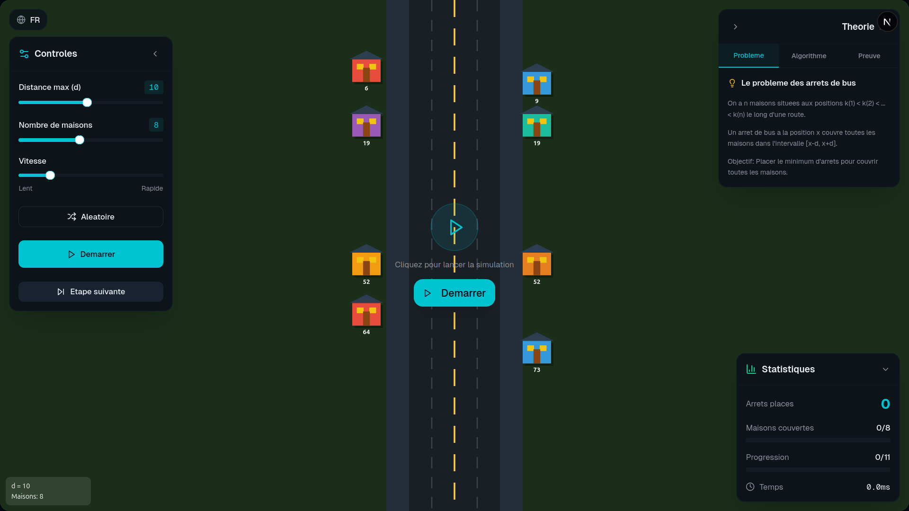
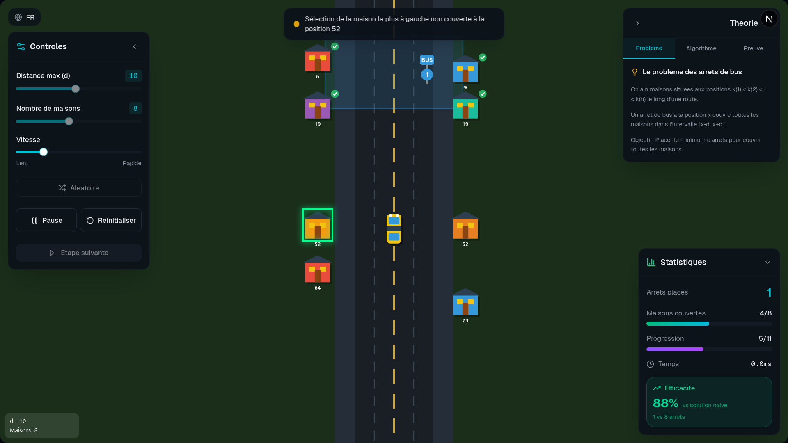
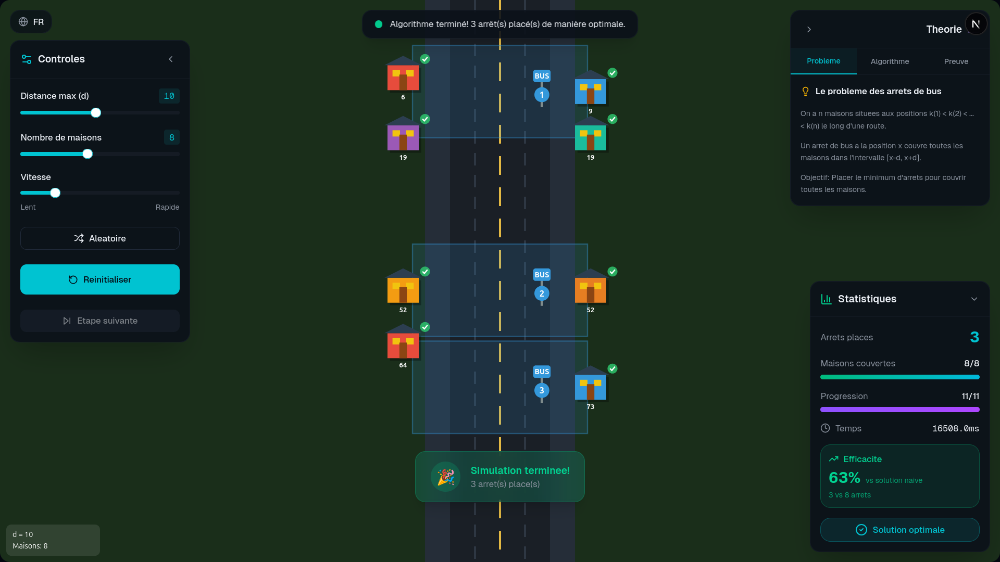
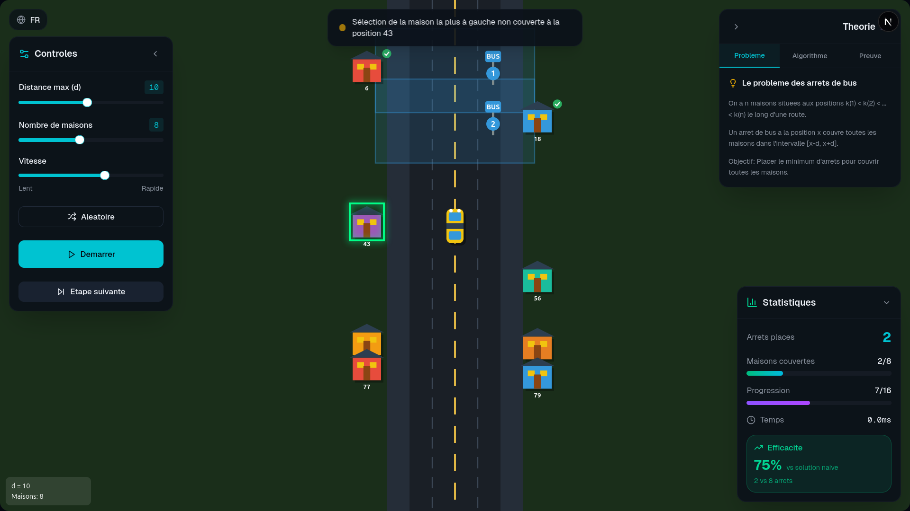
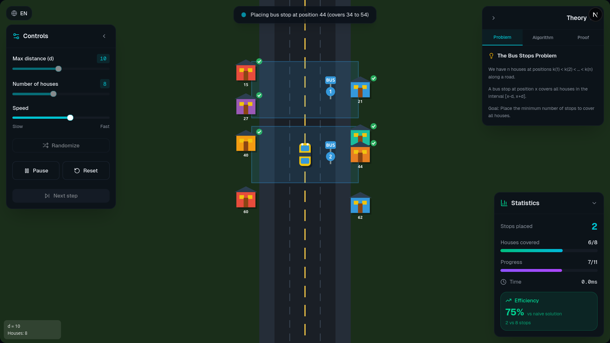
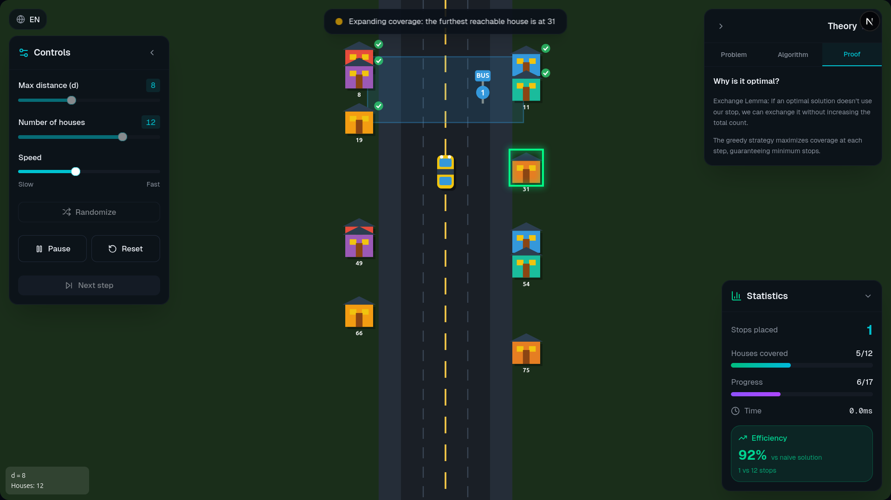

# Algorithmes Gloutons — Simulations Interactives
Ce projet est une application web interactive destinée à illustrer, simuler et analyser les algorithmes gloutons, à travers deux problèmes classiques :  💰 Rendu de monnaie (systèmes canoniques et non canoniques)  🚌 Placement optimal d’arrêts de bus

# 🧠 Algorithmes Gloutons — Simulations Interactives

## 📌 Présentation

Ce projet est une application web éducative dédiée à la **visualisation et à la compréhension des algorithmes gloutons**.

Il propose des **simulations interactives**, des **comparaisons d’algorithmes**, et des **explications pédagogiques**, afin d’aider les étudiants à comprendre :
- Comment fonctionne un algorithme glouton
- Pourquoi il est parfois optimal
- Dans quels cas il échoue
- Quelle est sa complexité algorithmique

---

## 🎯 Objectifs pédagogiques

- Illustrer la **prise de décision locale** des algorithmes gloutons
- Montrer la différence entre **solution optimale et gloutonne**
- Comprendre les **systèmes canoniques vs non canoniques**
- Visualiser l’optimisation du **placement d’arrêts**
- Démontrer la **complexité temporelle**
- Offrir un support **interactif pour l’enseignement**

---

## 🚌 Module — Placement d’arrêts de bus

### Problème :
Placer le **nombre minimal d’arrêts de bus** pour couvrir des maisons situées le long d’une route.

### Fonctionnalités :
- Simulation **vue du haut (top-down)** avec Canvas
- Bus animé sur une route verticale
- Placement glouton des arrêts
- Visualisation des **zones de couverture**
- Mode pas-à-pas
- Détection des **maisons couvertes**
- Comparaison :
  - Algorithme glouton
  - Algorithme naïf
  - Placement aléatoire

### Objectif pédagogique :
Illustrer comment un algorithme glouton peut **optimiser une couverture minimale** en prenant des décisions locales.

---

## 📊 Concepts algorithmiques abordés

- Algorithmes gloutons
- Preuve d’optimalité locale
- Cas d’échec du glouton
- Complexité temporelle (O(n log n), O(n))
- Comparaison avec programmation dynamique
- Visualisation de décisions algorithmiques

---

## Captures d'écran du projet

Voici quelques captures de l'application :









> Les fichiers complets se trouvent dans `assets/screenshots/`

## 🛠️ Technologies utilisées

- **Next.js**
- **React**
- **TypeScript**
- **Canvas 2D**
- **Tailwind CSS**
- **Animations interactives**

---

## 🚀 Installation

```bash
git clone https://github.com/Adam01-i/SIMULATION-ARRET-BUS-ALGORITHME-GLOUTON.git
cd nom-du-projet](https://github.com/Adam01-i/Bus-Stop-Simulation-avec-l-Algorithme-de-Glouton.git)
npm install
npm run dev
